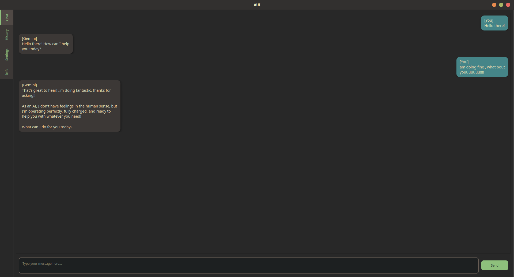

# AUI — Artificial User Interface

**AUI** is a sleek, modern, AI-powered chat client built with **PyQt5** and themed using **Gruvbox** for a polished user experience. Designed for local usage with support for the **Gemini API**, it offers a customizable, fluid, and beautiful desktop AI chat environment — right on your system.

---

## Features

- Beautiful, themed chat UI (Gruvbox, Monokai, Catppuccin, etc.)
- Chat bubbles aligned (left for AI, right for user)
- Chat history with session management
- Settings panel with:
  - Font selection and scaling
  - Theme switching
  - API Key storage
- Keyboard Shortcuts:
  - `Ctrl+Enter` to send message
- Message input area always docked to bottom
- Auto-saving chat sessions
- Info tab for usage guidance
- Built-in motivational and taunting quotes from **Bennett Foddy**
- Smooth animations, UI feedback, and stylized interactions

## Installation

### Requirements

- Python 3.8+
- `PyQt5`
- Gemini API Key (optional for offline use)

Install dependencies:
